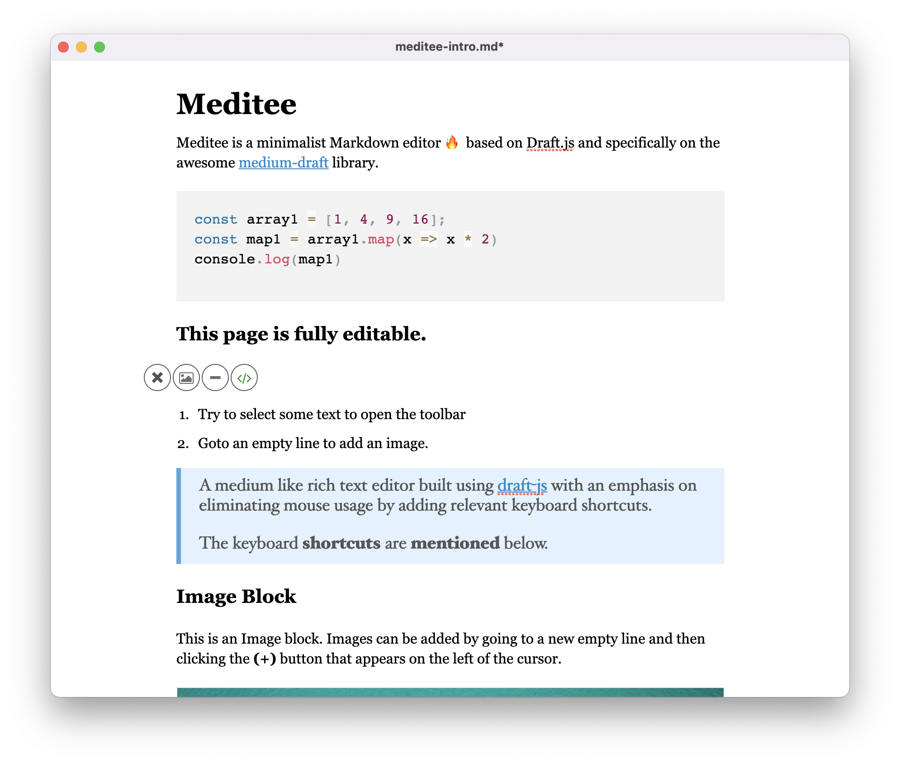

## About Meditee

**Meditee Desktop app** is a minimalist '**Medium like**' Markdown editor, based on [Draft.js](https://draftjs.org/) and specifically on [medium-draft](https://bitwiser.in/medium-draft/).

> The goal of this project is to provide a working desktop application using the awesome Draftjs with electron to edit Markdown files.

<div align="center">

</div>


## Download

<table width="100%">
<tr>
  <td>Mac</td>
  <td>
    <a href="https://github.com/alagrede/meditee/releases/download/latest/Meditee-1.0.0.dmg">[x64]</a>
    <a href="https://github.com/alagrede/meditee/releases/download/latest/Meditee-1.0.0-arm64.dmg">[arm64]</a>
  </td>
</tr>
<tr>
  <td>Windows</td>
  <td>
    <a href="https://github.com/alagrede/meditee/releases/download/latest/Meditee-Setup-1.0.0.exe">x64</a>
  </td>
</tr>
<tr>
  <td>Linux</td>
  <td>
    <a href="https://github.com/alagrede/meditee/releases/download/latest/Meditee-1.0.0.AppImage">x64</a>
  </td>
</tr>
</table>




### Built With

* [React.js](https://reactjs.org/)
* [Draft.js](https://draftjs.org/)
* [Electron template](https://github.com/electron-react-boilerplate/electron-react-boilerplate)
* [medium-draft](https://bitwiser.in/medium-draft/)

<p align="right">(<a href="#top">back to top</a>)</p>


## Getting Started

1. Clone the repo
   ```sh
   git clone https://github.com/alagrede/meditee.git
   ```
2. Install NPM packages
   ```sh
   npm install
   ```
3. Run app
   ```sh
   npm start
   ```
4. Packaging app
   ```sh
   npm run package
   ```

## Roadmap

- [x] Add Markdown read/write support
- [x] Add "Open with"
- [x] Add Code highlight 
- [ ] Figure out how to properly reset the contentState to avoid reloading the application when changing file  
- [ ] Add Frontmatter support
- [ ] Add Mermaid support

See the [open issues](https://github.com/alagrede/meditee/issues) for a full list of proposed features (and known issues).

<p align="right">(<a href="#top">back to top</a>)</p>


## Contributing

If you have a suggestion that would make this better, please fork the repo and create a pull request. You can also simply open an issue with the tag "enhancement".
Don't forget to give the project a star! Thanks again!

1. Fork the Project
2. Create your Feature Branch (`git checkout -b feature/AmazingFeature`)
3. Commit your Changes (`git commit -m 'Add some AmazingFeature'`)
4. Push to the Branch (`git push origin feature/AmazingFeature`)
5. Open a Pull Request

<p align="right">(<a href="#top">back to top</a>)</p>


## License

Distributed under the MIT License. See `LICENSE.txt` for more information.

<p align="right">(<a href="#top">back to top</a>)</p>


## Contact

Your Name - [@alagrede](https://twitter.com/alagrede) - lagrede.anthony@gmail.com

Project Link: [https://github.com/alagrede/meditee](https://github.com/alagrede/meditee)

<p align="right">(<a href="#top">back to top</a>)</p>
